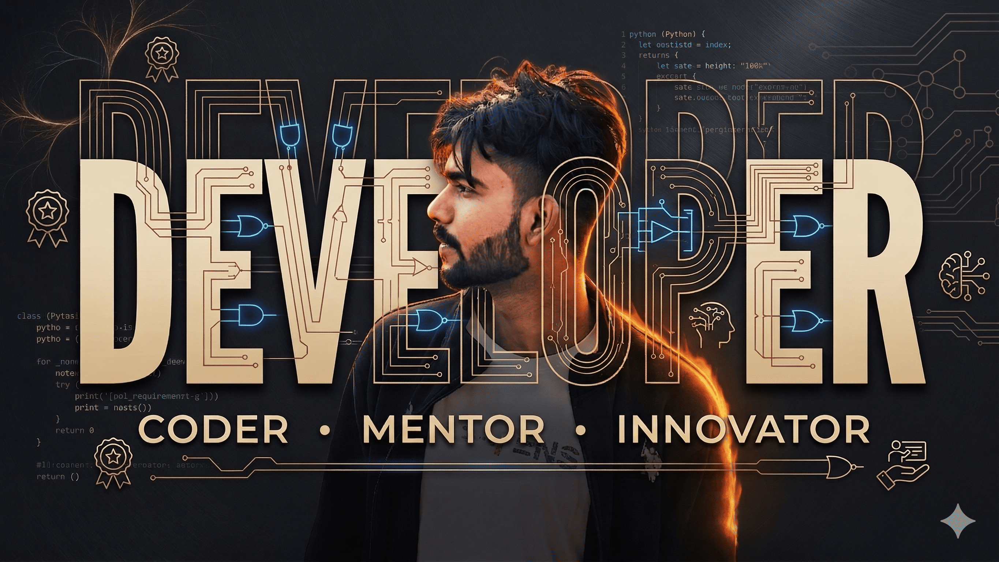

<!-- HERO SECTION -->

 

<h1>👋 Hey, I'm Aman Raj!</h1>

I build <b>AI-powered intelligent systems</b> by blending Machine Learning, Data Science, and Full Stack Development to solve real-world problems 🚀

  

 
✨ Live | AI Projects | Full Stack Systems | Real World Solutions

---

## 🧠 AI & Developer Profile

- 🚀 Full stack developer shipping production apps with Django + React + MySQL/PostgreSQL  
- 🤖 Applying ML/DL (Python, Scikit-learn, TensorFlow, PyTorch) to real prediction & automation problems  
- 🔭 Currently building AI-driven platforms — education systems, service marketplaces, admin dashboards  
- 🌱 Leveling up in MLOps, cloud deployment (AWS), and scalable backend architecture  
- 💡 I ship end-to-end: data pipeline → model → API → UI

---

## ⚙️ Tech Stack

**Languages**
 

**Frontend**
 

**Backend**
 

**Database**
 

**Data Science & AI**
 

**Cloud & Tools**
 

---

## 🛠️ What I Love To Build

- 🧠 Intelligent systems that learn from data  
- ⚡ Automation pipelines & backend systems  
- 📊 Predictive analytics & decision engines  
- 🌐 AI-powered scalable web applications  

---

## 🚀 Featured Projects

| Project | Description | Stack |
|---------|-------------|-------|
| **[Certibyt](https://certibyt.com)** · [repo](https://github.com/Aman-0402/CertiVerse) | Multi-tenant exam & certification SaaS — proctored exams, voucher commerce, certificate verification, 186 automated tests | Django · React · Redux Toolkit · MariaDB · JWT |
| **[ConsultME](https://consultmee.in)** · [repo](https://github.com/Aman-0402/ConsultME) | Consultancy marketplace — real-time chat, escrow payments, reschedule engine | Django · DRF · React · Redis · Celery · Channels |
| **[UrbanEase](https://github.com/Aman-0402/UrbanEase)** | Hyperlocal service marketplace — geolocation discovery, full booking lifecycle | Django · DRF · React · MySQL · Zustand |
| **[TMS](https://tmsethnotec.netlify.app)** | Training management system — students, batches, attendance, exams, certificates (production, Ethnotech Academy) | Django · DRF · React · Vite · MySQL |

---

## 💻 More Projects

| Project | Description | Tech |
|---------|-------------|------|
| [Wine Quality Prediction](https://github.com/Aman-0402/Wine-Quality-prediction) | ML model predicting wine quality | Python, Sklearn |
| [Watermarking Attacks & Recovery](https://github.com/Aman-0402/Watermarking_Attacks_and_Recovery) | Image processing & security system | OpenCV, Python |
| [Blood Donation App](https://github.com/Aman-0402/Blood_Donation_PythonDjango) | Django-based full stack healthcare system | Django |
| [EchoSpace Blog CMS](https://github.com/Aman-0402/EchoSpace-Blog-Management-System-) | Role-based blog management system with CRUD | Django |
| [React Todo App](https://github.com/Aman-0402/React_todo_app) | Clean & responsive React UI | React |

---

## 📚 Currently Learning

- Advanced Machine Learning  
- Deep Learning Architectures  
- MLOps & Model Deployment  
- Cloud-native AI Systems  

---

## 📊 GitHub Stats

 

---

## 📬 Connect With Me

---

## 🎯 AI Vision

> ⚡ *I don’t just write code — I engineer intelligent systems that learn, adapt, and create impact.*

---

### 🚀 Let’s build the future with AI 🚀

